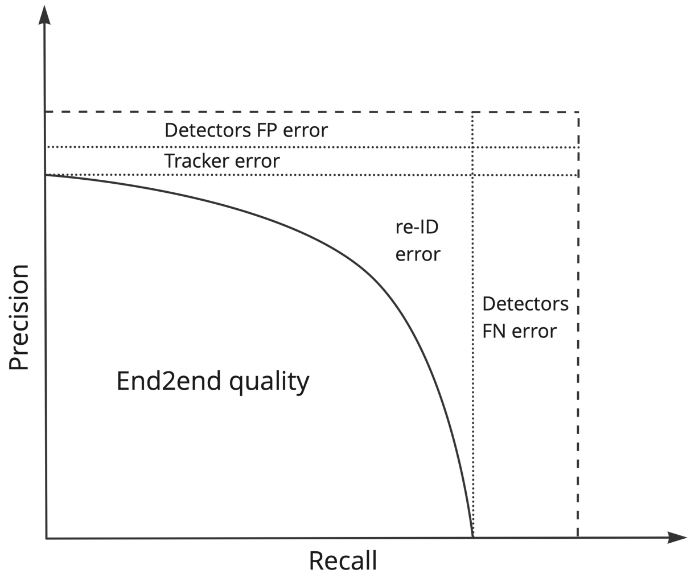

# Multi-Camera Tracking Error Analysis

  
*Figure 1: System pipeline with error decomposition modules*

## Quick Setup

```bash
git clone https://github.com/Rusamus/mmcmt_metric.git
cd mmcmt_metric
pip install -r requirements.txt
mkdir -p models && wget -P models/ \
  https://example.com/retinanet.pth \
  https://example.com/deepsort.pth \
  https://example.com/osnet_ibn.pth
```

## Basic Usage

```bash
python eval.py \
  --input_dir ./data \
  --output_dir ./results \
  --classes 1 2  # Person, vehicle
```

## Key Metrics

| Metric        | Description                          |
|---------------|--------------------------------------|
| **Det-FP**    | False positive detection rate        |
| **Track-IDSW**| Identity switches in tracking        | 
| **ReID-FN**   | Cross-camera re-identification misses|


## Citation

```bibtex
@article{musaev2024mcmt,
  title={Disentangling Errors in Multi-Camera Tracking Systems},
  author={Musaev, Ruslan},
  journal={arXiv preprint arXiv:XXXX.XXXXX},
  year={2024}
}
```
